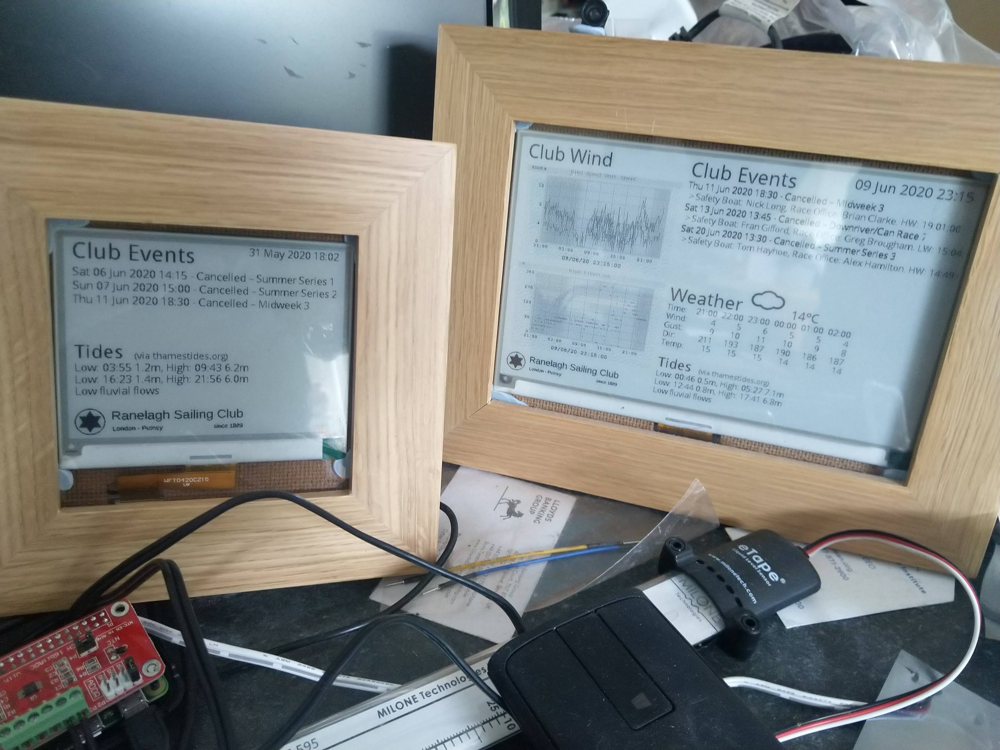

# EDisplay
Epaper display supporting multiple display unit

This is fork of the Epaper project that splits the code into a server element that creates images and a client that displays the code allowing the client to be both remote (and simplified) and also support different type of display units.

The intention is that will support IoT displays that are battery powered using an ESP8266

Thanks to @nike199000 for her help in the architecture changes and restructuring the code base

